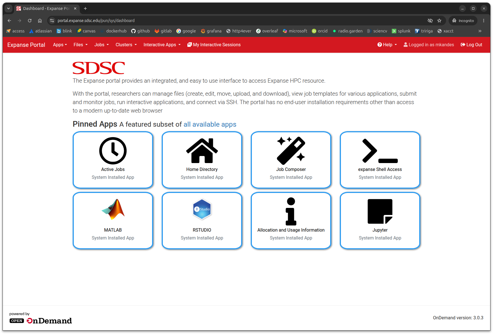
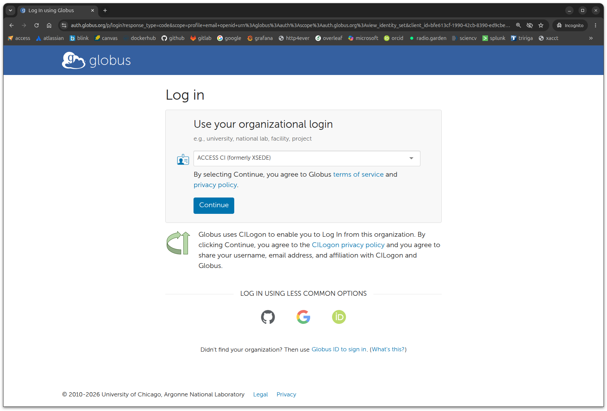
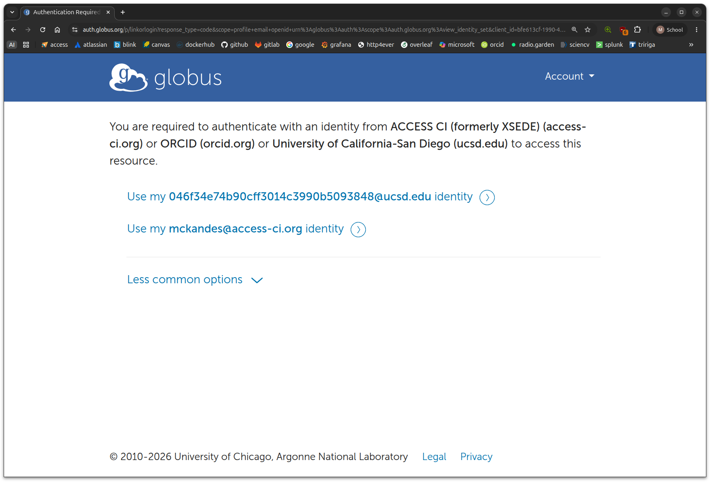

# Exercise 1: Login via the Expanse User Portal

We'll start this session by logging into the web-based **Expanse User Portal** (as shown above).

- Step 1: Open the link in a new browser tab: [https://portal.expanse.sdsc.edu](https://portal.expanse.sdsc.edu).

When you open the link a new tab, your browser should be redirected to a Globus login page (as shown below). There you will be asked to **Use your organizational login**. However, you should choose **ACCESS-CI (formerly XSEDE)**  as your organization, not your academic or research institution. Once you've selected **ACCESS-CI (formerly XSEDE)**, click *Continue*. 

If you happened to already be logged into Globus through your web broswer, you will not be prompted to select an organization. Instead, you'll see a list of your linked Globus identities. If you see your `@access-ci.org` identity, click on that one. If you do not see that one, either switch to a new browser window in private mode OR logout of your current Globus account, then attempt your Expanse User Portal login again.

Next, you'll be redirected again to ACCESS-CI and be prompted with entering your *ACCCESS ID* and *ACCESS Password*. Enter your ACCESS ID (username) and password here, then click *LOGIN*. This is the 1st-factor in the two-factor (2FA) authentication process. If successful, you'll then be prompted with your 2nd-factor authentication step provided via Duo. Follow your default Duo option to complete the 2FA process. If you run into issues with the 2nd-factor process, you may try one of the *Other options* provided by Duo. 

Upon a successful login, you should be presented with the *Expanse Portal* dashboard, which lists a number of options along the top menu bar and displays a number of *Pinned Apps*. As your first test use case for the portal, click on the *expanse Shell Access* app to start a web-based interactive login shell on one of Expanse's login nodes. If the *expanse Shell Access* app fails drop you into a shell prompt on a login node, close that browser tab and then navigate back to the main dashboard. Select *Restart Web Server* from the *Help* drop-down menu before you try to access the *expanse Shell Access* app again.

If you're still having a problem with accessing the portal or the shell app, please drop us a screenshot of where you are getting stuck in the Slack channel. 
