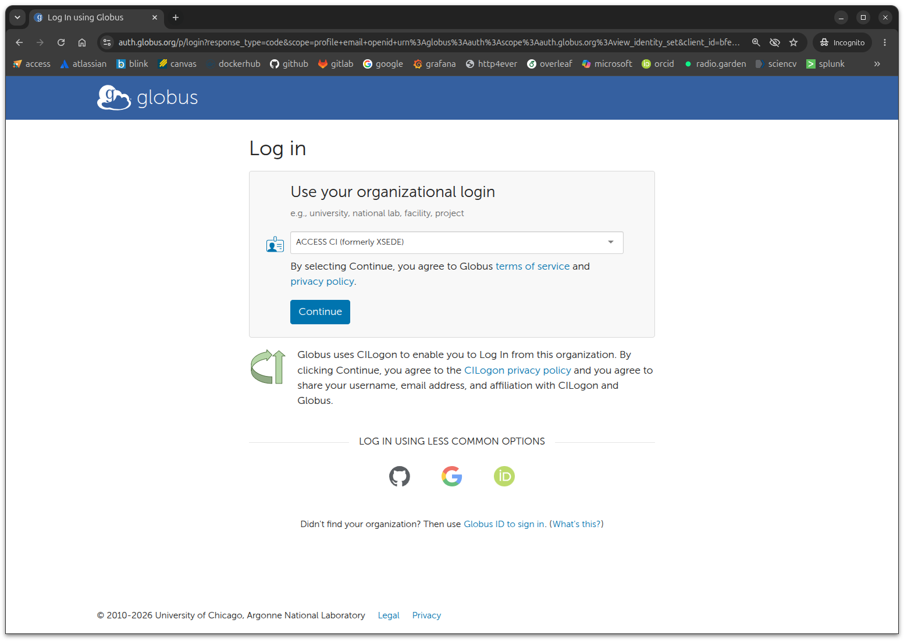
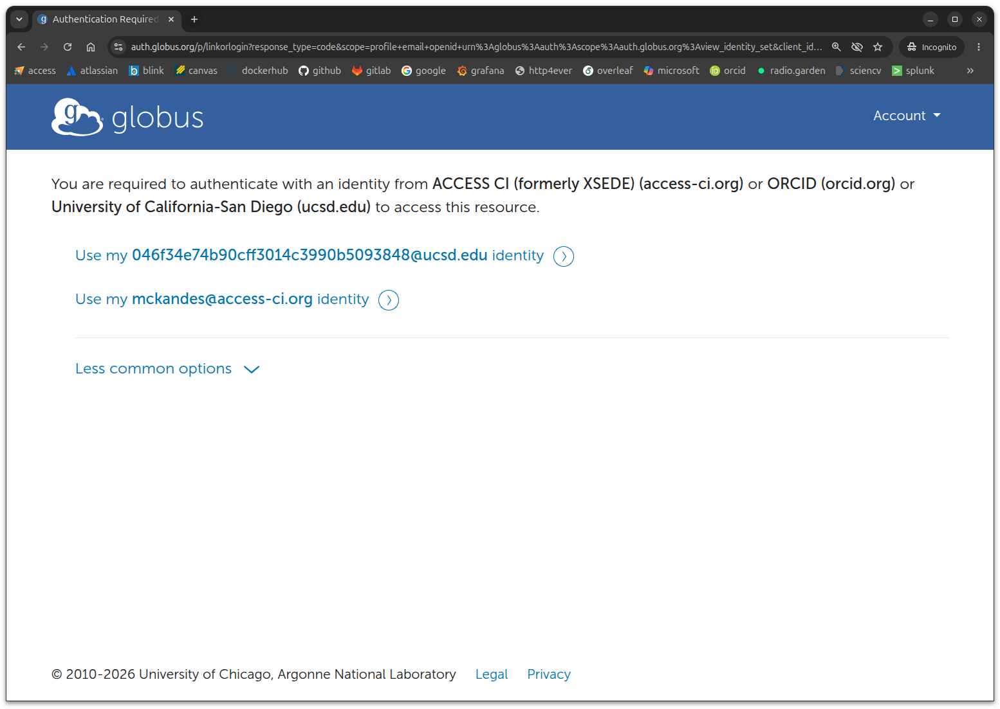
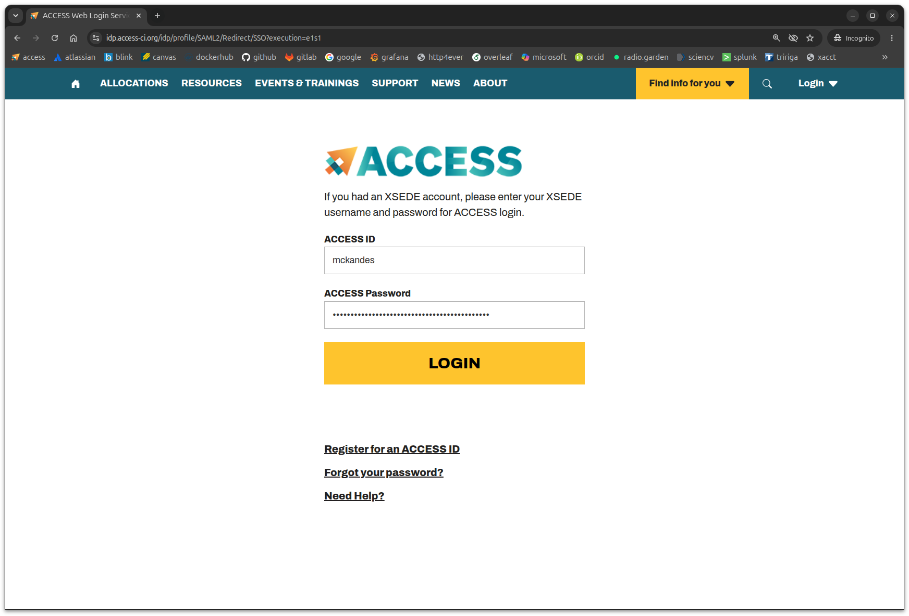
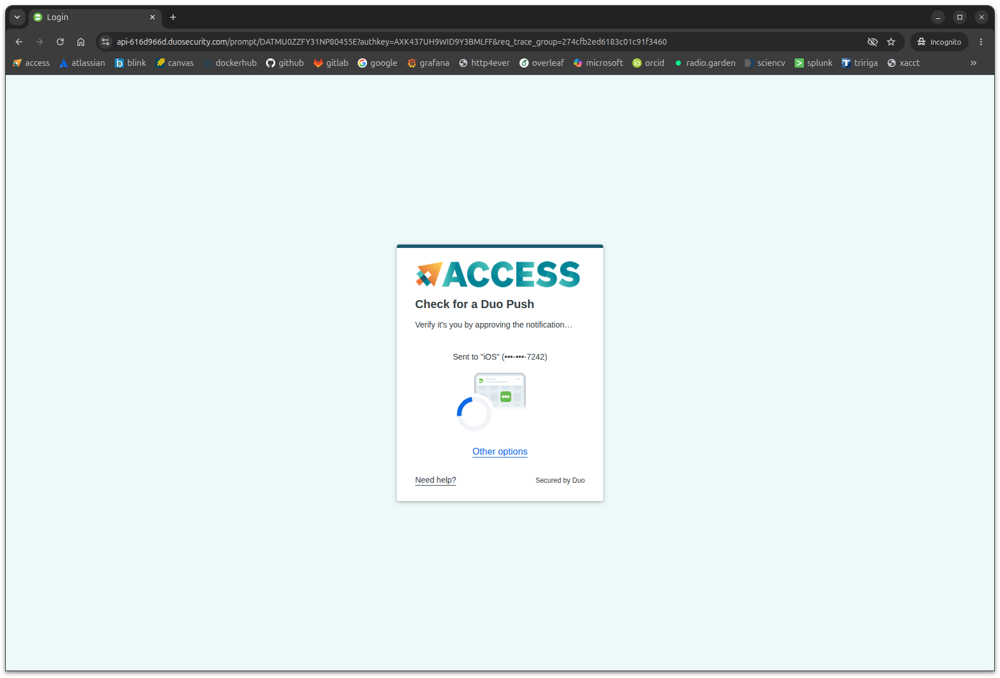
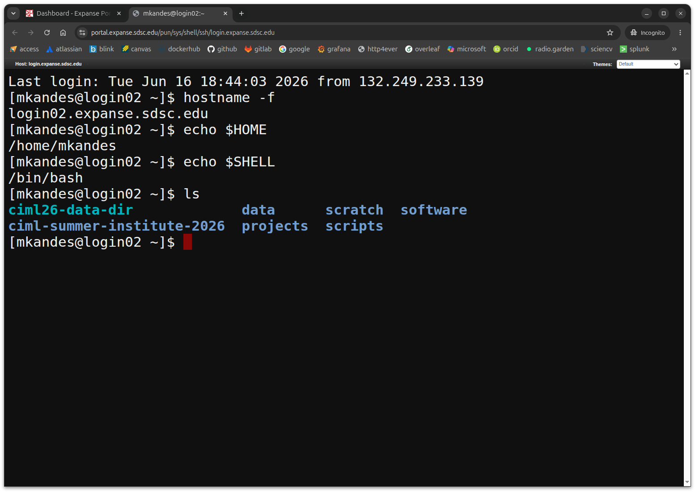
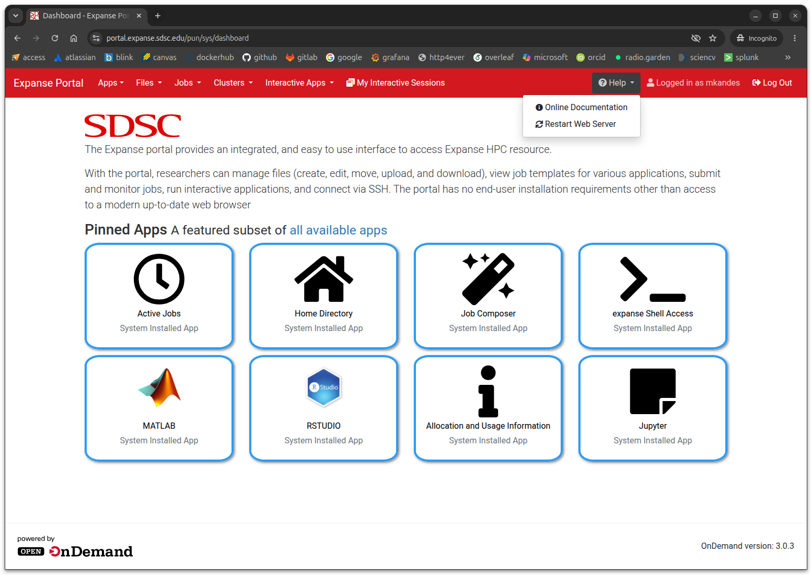

# Exercise 1: Login via the Expanse User Portal

We'll start this session by logging into the web-based **Expanse User Portal** (as shown below).

- Step 1: Open Link in New Private Window : [https://portal.expanse.sdsc.edu](https://portal.expanse.sdsc.edu).

When you open the link, your browser should first be redirected to a Globus login page (as shown below). At the Globus login page, you will be asked to **Use your organizational login**. However, you should choose **ACCESS-CI (formerly XSEDE)**  as your organization, not your academic or research institution.

- Step 2: Select **ACCESS-CI (formerly XSEDE)** as your organizational login, then click *Continue*

If you were already be logged into Globus through your web broswer, you will not be prompted to select an organization. Instead, you'll see a list of your linked Globus identities (as shown below). If you see **Use my `username@access-ci.org` identity** as an option, click on that one. If you do not see that one, either switch to a new browser window in private mode OR logout of your current Globus account, then attempt your Expanse User Portal login again.

- Step 2 (Alternative): Select **Use my `username@access-ci.org` identity** *OR* start over at Step 1 in a private browser window. 

You'll next be redirected to ACCESS-CI, where you will be prompted to enter your **ACCCESS ID** and **ACCESS Password** (as shown below).

- Step 3: Enter your **ACCESS ID (username)** and **ACCESS Password**, then click *LOGIN*. 

This is the 1st-factor in the ACCESS-CI two-factor (2FA) authentication process. If successful, you'll then be prompted with your 2nd-factor step via **Duo** (as shown below). 

Follow your default Duo authentication option to complete the 2FA process. If you run into issues with your default 2nd-factor option, you may try one of the *Other options* provided by Duo.

- Step 4: Complete your **Duo** authentication option. 

Upon a successful login, you should be presented with the *Expanse Portal* dashboard (as shown at the beginning of this exercise), which displays a number of menus along the top menu bar and displays a number of *Pinned Apps*. As your first test use case for the portal, open the **expanse Shell Access** app to start a web-based interactive login shell on one of Expanse's login nodes (as shown below) 

- Step 5: Click on the **expanse Shell Access** app.

If the **expanse Shell Access** app fails drop you into a shell prompt on a login node, close that browser tab and then navigate back to the main dashboard. Select *Restart Web Server* from the *Help* drop-down menu (as shown below) before you try to access the *expanse Shell Access* app again.

If you're still having a problem with accessing the Expanse User Portal in any way, please drop us a screenshot of where you are getting stuck in the Slack channel. 
